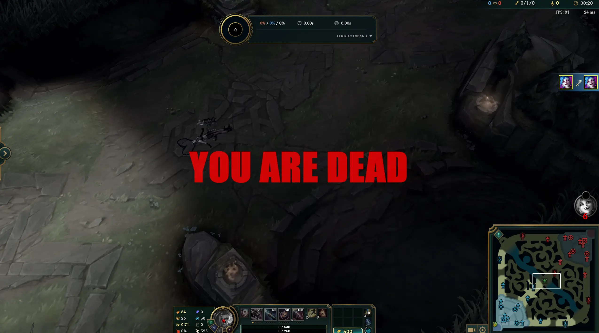

# Death Message Overlay for League of Legends

This application shows a message overlay when your character dies in League of Legends.

## Screenshots



## Installation

1. Install the required dependencies:

```bash
pip install requests
```

2. Run the application:

```bash
python main.py
```

or for debug mode:

```bash
python main.py --debug
```

## Configuration

You can customize the overlay via the config.json file by modifying "overlay_text", "font_family", "font_size", and "text_color".

## How it works

The application uses the League of Legends Live Client Data API to detect when your character dies. When this happens, the application shows a message overlay on your screen. Simple as that!
